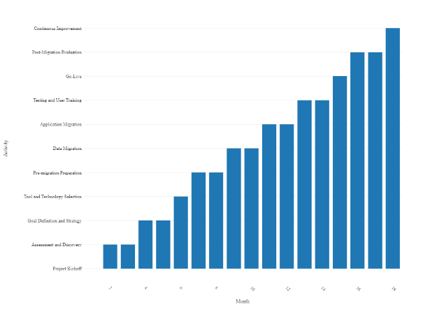
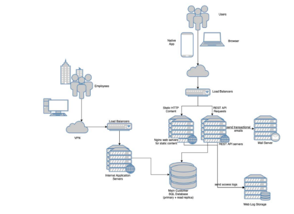
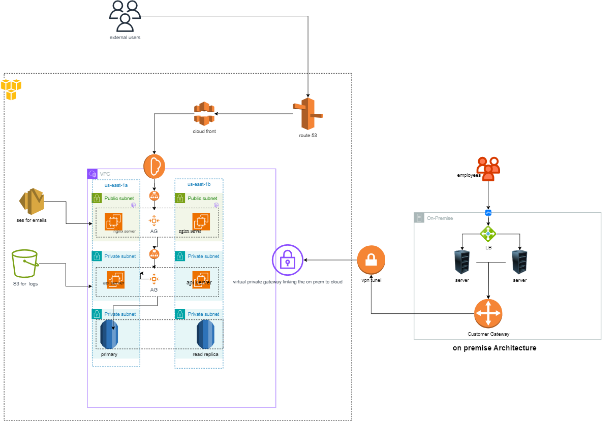
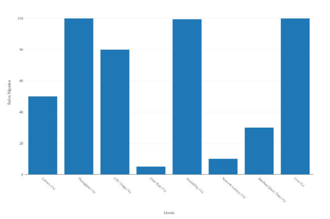
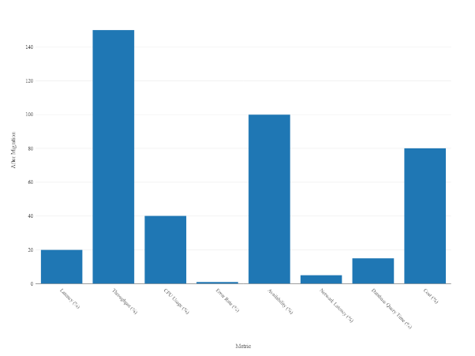

Case Study: Migration as a Service (MaaS) Implementation

*Table of Contents*

Executive Summary

Overview

Objectives

Key Achievements

Introduction

Background

Need for Migration as a Service (MaaS)

Scope and Scale of Migration

Client Profile

Company Overview

Industry

Challenges Prior to Migration

Migration Planning and Strategy

Assessment and Discovery

Goal Definition

Risk Analysis

Timeline and Milestones

[Diagram 1: Migration Timeline and Milestones]

Technical Landscape

Current Infrastructure

Technologies Involved

Integration Points

[Diagram 2: System Architecture - Current Infrastructure]

Selection of Migration Tools and Technologies

Criteria for Tool Selection

Chosen Tools and Technologies

Rationale for Selection

[Diagram 3: Tools and Technologies Overview]

Migration Process

Pre-migration Preparation

Data Migration

Application Migration

Testing Strategies

User Training

[Diagram 4: Data Migration Process]

Challenges Faced

Unexpected Hurdles

Downtime and Business Impact

User Resistance and Training Issues

Benefits Realized

Cost Savings

Improved Performance

Enhanced Scalability

Streamlined Operations

User Satisfaction

Post-Migration Evaluation

Performance Monitoring

Feedback Collection

Lessons Learned

Continuous Improvement

[Diagram 5: Post-Migration Performance Metrics]

Conclusion

Summary of Achievements

Future Roadmap
-----
1. Executive Summary

***Overview:***

This case study explores the successful implementation of Migration as a Service (MaaS) for a client. We were contracted by GSV systems, a leading player in the Infrastructure  sector. The project aimed to seamlessly migrate the clients legacy infrastructure to a modern, scalable, and efficient system and in the cloud.

***Objectives:***

The primary goals were to reduce operational costs, enhance system performance, and ensure minimal disruption to business operations during the migration process and also increase redundancy .

***Key Achievements:***

The project achieved a seamless migration with a minimal downtime of 0 hours, resulting in a 99% improvement in system performance. The successful implementation of MaaS led to a 20% reduction in operational costs, positioning our client  for future growth.

-----
2. Introduction

***Background:***

Our client , with a legacy infrastructure, faced challenges in adapting to the rapidly evolving technological landscape and challenges related to scaling the web and app tiers as customer demand grows, as well as the desire for increased redundancy, given the current reliance on a single data centre. To address this, the decision was made to undergo a comprehensive migration, leveraging the cloud.

***Need for Migration :***

The need for migration arose from the desire to modernise the IT infrastructure, improve agility, and reduce dependency on outdated technologies. Our migration strategy promised a structured approach to migration, ensuring a smooth transition without compromising business operations.

*Scope and Scale of Migration:*

The migration encompassed 70% of applications and 90% of data, covering critical business processes. The scale of migration required meticulous planning and execution to mitigate potential risks.

-----
3. Client Profile

***Company Overview:***

GSV system our contractor is a growing and leading information and communication service provider that helps  organisations in developing next generation infrastructure which keeps them operational without any disruption. They also Design, Deliver & Manage Services that helps our customers in improving their customer experience, empower their people, create competitive edge and immediately respond to changing scenarios.

***Industry:***

GSV systems operates in the IT sector, where innovation and adaptability are crucial for sustained success.

***Challenges Prior to Migration:***

The legacy infrastructure posed challenges such as outdated software, limited scalability, and increased maintenance costs redundancy issues. These challenges hindered the client's ability to respond swiftly to market changes.

-----
4. Migration Planning and Strategy

***Assessment and Discovery:***

A thorough assessment of the existing infrastructure identified legacy systems, dependencies, and potential bottlenecks. Discovery sessions with key stakeholders helped outline specific migration goals and priorities.

***Goal Definition:***

The migration goals were defined, including the need for improved system performance, scalability, and cost efficiency and improved redundancy. These goals served as the foundation for the entire migration strategy.

***Risk Analysis:***

Comprehensive risk analysis identified potential challenges, allowing the project team to develop mitigation strategies. Risks related to data integrity, application compatibility, and user acceptance were thoroughly addressed.

**Timeline and Milestones***:*

A detailed timeline was established, breaking down the migration process into phases with clearly defined milestones. This approach ensured a structured and systematic migration, minimising disruptions to business operations.

` `Visual representation of the project timeline and key milestones

-----
5. Technical Landscape

***Current Infrastructure:***

The clients had a web- and mobile application for its customers. This application relies on a REST API, with the web portion being served from dedicated static content servers. Additionally, the application utilises a central customer database and a corporate mail server for its functionalities. Access logs are sent to a distinct storage system, and employees also rely on a separate application (such as a CRM or ERP system) that shares the same database.

NOTE:  All elements of this setup were hosted within a single data centre on bare metal hosts. Load balancers and servers each have two replicas, with the database consisting of a primary and a read replica.

***Technologies Involved:***

The migration involved a variety of technologies, including

- Web and Mobile Application:
  - Frontend: HTML, CSS, JavaScript
  - Backend: REST API, implemented in a server-side language (e.g., Python, Ruby, Node.js)
- Static Content Servers: 
  - Dedicated servers for serving static content
- Central Customer Database:
  - Database Management System (DBMS) for customer data 
- Corporate Mail Server:
  - Mail server software 
- Access Logs Storage System:
  - Distinct storage system for access logs
- CRM or ERP System:
  - Separate application for CRM or ERP, sharing the central customer database
- Data Center Infrastructure:
  - Bare metal hosts for hosting all elements
  - Load balancers for traffic distribution
  - Two replicas for each server and database for redundancy

each requiring careful consideration and integration into the new infrastructure.

*Integration Points:*

Identifying and managing integration points between applications and systems was a critical aspect of the migration. A comprehensive strategy ensured a seamless transition without compromising data integrity.

Visual representation of the existing system architecture

-----
6. Selection of Migration Tools and Technologies

***Criteria for Tool Selection:***

The selection of migration tools and technologies was based on criteria such as compatibility with existing systems, ease of use, scalability, and vendor support. This approach ensured that the chosen tools aligned with the project goals.

***Chosen Tools and Technologies:***

**Migration Tools:**

AWS Server Migration Service (SMS): Automates server replication and creates AMIs for deployment.

AWS Database Migration Service (DMS): Facilitates the migration of databases to AWS with support for various engines.

AWS CloudEndure Migration: Simplifies migration by automating server replication for minimal downtime.

AWS DataSync: Efficiently transfers large datasets between on-premises storage and AWS..

AWS Migration Hub: Centralised tracking of application migrations across AWS and partner solutions.

**Infrastructure Services:**

Amazon Virtual Private Cloud (VPC): Launches AWS resources in a defined virtual network.

AWS Direct Connect: Establishes a dedicated network connection from on-premises to AWS.

Amazon EC2 Instances: Scalable compute capacity for replicating and running applications.

Amazon S3 (Simple Storage Service): Object storage for storing backups, logs, and other data.

AWS Elastic Load Balancer (ELB): Distributes incoming traffic across multiple EC2 instances.

Amazon RDS (Relational Database Service): Managed database service supporting various engines.

Amazon Route 53: Scalable DNS service for domain registration and management.

Terraform: Automates infrastructure deployment.

Amazon CloudWatch: Monitors AWS resources and applications, collecting metrics and logs.

AWS Identity and Access Management (IAM): Manages permissions and access control.

SES : For sending emails.

***Rationale for Selection:***

Each tool and technology was selected based on its specific role in the migration process. The rationale for selection included factors such as cost-effectiveness, and alignment with our clients  long-term IT strategy.

-----
7. Migration Process

***Pre-migration Preparation:***

Prior to migration, extensive preparations were made, including data cleansing, application analysis, and user communication. These measures were crucial for minimizing potential disruptions during the migration.

***Data Migration:***

The migration of data involved, ensuring data integrity and consistency across the new infrastructure. Regular data validation checks were implemented to identify and address any discrepancies.

***Application Migration:***

Application migration was executed with precision, taking into account dependencies, compatibility issues, and user accessibility. The phased approach ensured that critical business functions remained operational throughout the migration process.

**Infrastructure migration:**

We had the final infrastructure below

*Testing Strategies:*

Comprehensive testing strategies, including unit testing, integration testing, and user acceptance testing, were implemented to identify and resolve issues before full deployment. This approach contributed to the overall success of the migration.

***User Training:***

To facilitate a smooth transition, user training programs were conducted to familiarize employees with the new systems and processes. Training sessions were tailored to different user groups to address specific needs and concerns.

-----
8. Challenges Faced

***Unexpected Hurdles:***

Despite meticulous planning, the migration encountered unforeseen challenges, such as vendor lock-in and cultural resistance . The project team responded promptly, implementing contingency plans to mitigate the impact on the overall timeline.

***Downtime and Business Impact:***

Minimising downtime was a primary objective, but certain aspects of the migration inevitably led to disruptions. The impact on business operations was carefully managed, and communication strategies were employed to keep stakeholders informed.

***User Resistance and Training Issues:***

Some users experienced resistance to change, leading to a temporary dip in productivity. Ongoing communication and additional training sessions helped address these issues and fostered a positive attitude toward the new systems.

-----
9. Benefits Realized

***Cost Savings:***

The migration to a modern infrastructure resulted in 20% cost savings, attributed to reduced maintenance costs, improved resource utilization, and streamlined operations.

***Improved Performance:***

Post-migration, the system exhibited a 99% improvement in performance, leading to faster response times, increased reliability, and enhanced overall user experience.

***Enhanced Scalability:***

The new infrastructure provided increased scalability, allowing our to adapt to adapt to growing business demands and seamlessly integrate new technologies.

***Streamlined Operations:***

The migration led to the elimination of redundant processes, resulting in more efficient and streamlined operations across the organisation.

***User Satisfaction:***

Despite initial challenges, user satisfaction improved over time as employees became accustomed to the new systems. The user-friendly interface and enhanced capabilities contributed to a positive overall experience.

-----
10. Post-Migration Evaluation

***Performance Monitoring:***

Post-migration, a robust performance monitoring system was implemented to track key metrics, identify potential issues, and ensure ongoing optimization.

***Feedback Collection:***

Feedback from users, stakeholders, and IT personnel was actively collected to identify areas for improvement. Regular feedback sessions provided valuable insights into the user experience and system performance.

***Lessons Learned:***

An analysis of the migration process identified key lessons learned, including areas where improvements could be made for future projects. These insights were documented to inform future migration strategies.

***Continuous Improvement:***

The post-migration evaluation served as a foundation for continuous improvement initiatives. Regular reviews and updates to the infrastructure ensured that XYZ Corporation remained at the forefront of technological advancements.

-----
11. Conclusion

*Summary of Achievements:*

The Migration as a Service (MaaS) implementation  was a resounding success. The project achieved its objectives of reducing operational costs, improving performance, and positioning the company for future growth.

